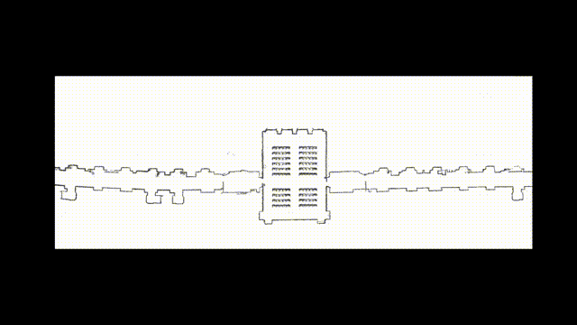

# ROS2 Mobile Robot Control and Visualization

## Project Overview

This project is a comprehensive program designed for controlling a mobile robot using ROS2 (Robot Operating System 2) while providing a user-friendly interface for visualizing essential system components. The program is capable of displaying a map, laser scans, mobile bases, and particles for localization.

## Features

### 1. Mobile Robot Control

The program enables seamless control of a mobile robot through ROS2. Users can send commands, navigate the robot, and monitor its movements in real-time.

### 2. Map Display

The application includes a map visualization feature, allowing users to view the environment and the robot's spatial awareness. This is particularly useful for mapping and navigation tasks.

## Demo

### 3. Laser Scans

Laser scans are crucial for detecting obstacles and obstacles avoidance. The program visualizes laser scan data in a clear and informative manner, aiding users in understanding the robot's perception of its surroundings.

